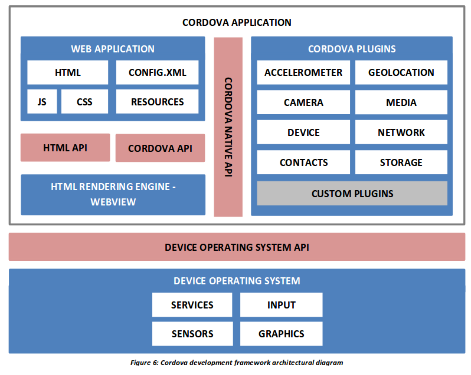
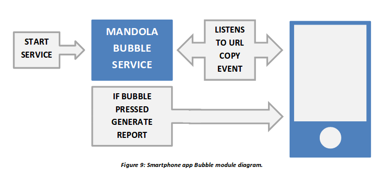

# MANDOLApp: Mobile Application for Anonymous Hate-speech Reporting 

MANDOLApp is a hate-speech reporting mobile application that is aims to provide:

  - The ability of anonymous reporting of hate-speech and other material found in the web and social media.
  - Cross platform compatibility between Android, IOS and Windows mobile devices.
  - Statistical analysis considering hate-speech in order to raise the awareness of the user about the impact of hate-speech on the world.

## Application Architecture

The MANDOLApp consists of the following two main modules:
- The **awareness module**, where static data is presented to the user in order to raise his/her awareness on the online hate-speech matter;
- The **anonymous reporting module**, which provides the users with methods in order to report hate-speech encounters anonymously.


The MANDOLApp provides two methods for reporting hate speech. The first one is via the MANDOLA Proxy server, which uses a way back machine and loads the selected URL in a web browser within the application (referred to as InAppBrowser) in order for the user to highlight the hate speech content. The MANDOLA Proxy is mainly used  for public encounters of hate speech in sources such as YouTube, Twitter, news sites and forums, where the content can be viewed publicly and the user is not required to provide any personal information. The second method for reporting hate speech is through the Photos or Screenshots via Optical Character Recognition. While the user is browsing with his/her private social media accounts via their native applications, he/she can take a screenshot and report the hate speech encounter without providing any personal information.

## Application Design
- **User Anonymity**: By providing users with an anonymity privilege, they are secured from the possibility of revenge and serious misuse, avoid persecution for their beliefs, opinions and views on political, religious and other matters. 
- **User Awareness:** Another crucial objective of the MANDOLApp is to raise user awareness on the problem of online hate-speech. The application tries to fill this gap by providing facts, statistics on hate-speech, analytics on events influencing hate-speech and also providing the FAQs, based on the [D.4.1 of MANDOLA](http://mandola-project.eu/m/filer_public/1a/af/1aaf50d3-8a38-40f4-b299-9c343f16cea1/mandola-d41.pdf).

## Developed with Cordova



The MANDOLApp is compatible with Android, iOS and Windows platforms. The application has been developed using the [Apache Cordova framework](https://cordova.apache.org/). Apache Cordova is a popular mobile application development framework which enables wrapping up of CSS, HTML, and JavaScript code depending upon the platform of the device. It extends the features of HTML and JavaScript to work with the device. The resulting applications are hybrid, meaning that they are neither truly native mobile application nor purely Web-based.

## Application Features
### Photo or Screenshot Reporting


The Optical Character Recognition module utilizes the Tesseract OCR system. The Tesseract OCR system is available under the Apache license and its development was sponsored by Google. It is also considered as one of the most accurate open-source OCR engines that are currently available. It can recognize a total of 100 languages, including English, Greek, French, Spanish and Bulgarian. It is available for Linux, Windows and Mac OSX but there are several implementations of it in order to run on mobile devices. The application uses the Javascript library of Tesseract, [TesseractJS](http://tesseract.projectnaptha.com/).

The optical character recognition module receive s as input the cropped image that contains hate speech, as well as the language of the content. To do so, the user goes through the process of selecting the screenshot from within his/her device gallery and loads the selected image in a cropper where the image must be cropped in the text boundaries. After the cropping is done, the new image along with the selected language goes in TesseractJS.

The selected language can be downloaded and configured from the application settings. Then the Tesseract loads the analogous language file and initiates the character recognition process . After the recognition is done, the generated text is received from the core application and loaded into the hate speech report.

### Reporting via MANDOLA Proxy


he MANDOLA Proxy method, as stated earlier, is for any public encounter of online hate speech. By public, we mean an encounter in web sites or social media where no credentials are necessary in order to view the content of the URL, e.g. a YouTube video link, a public Facebook group, a web site etc. The MANDOLA Proxy utilizes the [Wayback Machine](http://web.archive.org/), which is a digital archive of the World Wide Web.
By 2015, the Wayback Machine had archived 452 billion web pages over time and is still growing at a rate of about 20 terabytes each week.

This service enables users to see archived versions of web pages across time. The implementation of the MANDOLA Proxy was done with [PyWb](https://github.com/webrecorder/pywb), a Python implementation of the Wayback Machine.

The MANDOLA Proxy uses the Wayback Machine in order to gain the ability to append the reporting code within the web site and to prevent the user from logging in any web site that needs credentials.

Also, it uses the [TextHighlighter](http://mir3z.github.io/texthighlighter/), a JavaScript library that enables website text highlight. The user can load the URL via the MANDOLA Proxy and highlight the hateful content. After the text is highlighted,
the reporting form is shown in order to be filled by the user.

### Smooth UX with MANDOLA Bubble 



To provide users with a simpler and faster way of reporting, the MANDOLA Bubble was implemented and added as a background service to the Smartphone app. MANDOLA Bubble is a background
process that the user can enable from the settings view. It is built as a Cordova Plugin and utilizes the existing background mode plugin. As soon as the application is set to the background, the MANDOLA Bubble service is triggered and listens to possible URL copy events. A URL copy event is considered as any URL copy action done by the user from a source such as a mobile browser, or any native social media applications (e.g. Twitter, Facebook). The MANDOLA logo is drawn on the device’s screen which is used to display any sensed URL copy event, and by pressing it, the user will generate the MANDOLA report for that URL.

The on-screen drawing of the MANDOLA logo is only supported for
Android devices. For IOS devices the MANDOLA Bubble is still functional but instead of using the on-screen drawing, it utilizes the local notification services. If the user encounters hate speech while browsing any native social media application, he/she can copy the URL of the post and the service will capture this. Then, the user will be notified and by pressing the MANDOLA Bubble, the copied URL’s report will be automatically created and filled without needing to swap between processes. Afterwards, the user needs to validate the fields and select the corresponding hate categories. The use of this feature might encourage users to actively use the smartphone app.

## Installation
### Install from source code
Installing Cordova - Cordova command-line runs on NodeJS and is available on NPM. Follow platform specific guides to install additional platform dependencies. Open a command prompt or Terminal, and type:
```
$sudo install -g cordova
```
After the successful installation of Cordova, proceed on cloning this repository to your local machine by doing:
```
$git clone https://github.com/dpasch01/MANDOLApp
```
Now you need to install the front and backend dependencies. For this we use ``npm`` and ``bower``. From your terminal window, enter the ``MANDOLApp`` directory and execute the following:
```
$bower install
$npm install
$npm install del
$npm install fs
$npm install path
```
Now connect your mobile device(or simply use an emulator) and execute the following:
```
$cordova run android
```
### Install from binary
To install from the latest Android binary version, please follow the instructions [here](http://mandola.grid.ucy.ac.cy/~mandola/mandolapp/), until there is an official Google Play release.

## More Information
| Subject | Source |
| ------ | ------ |
| MANDOLA Project | [http://mandola-project.eu][PlDb] |
| MANDOLA Dashboard | [http://mandola.grid.ucy.ac.cy/][PlGh] |
| MANDOLA Dashboard Documentation | [http://mandola-project.eu/m/filer_public/06/b9/06b92efd-cce2-4204-a2a9-5eb2c34912f7/mandola-d31.pdf][PlGd] |
| MANDOLA Reporting Application Documentation | [http://mandola-project.eu/m/filer_public/9e/09/9e09f655-1c23-4da6-928a-ec534a946867/mandola-d339.pdf][PlOd] |
| MANDOLA Reporting Portal | [http://mandola-project.eu/portal/][PlMe]

